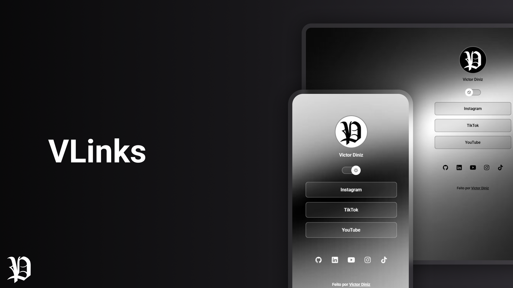

<h1 align="center">VLinks</h1>

  

## 💻 Tecnologias

Esse projeto foi desenvolvido com as seguintes tecnologias:

- HTML e CSS

- Git e Github

- Figma

## ⚙️ Projeto

Agregador de links para  a distribuidora SD.

[Acesse a versão final do projeto, online](https://victorhdnz.github.io/SD/)
